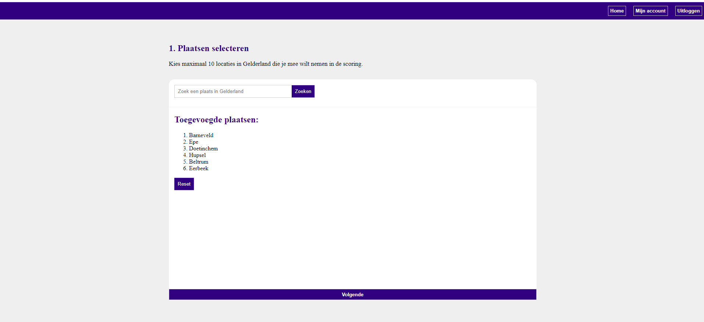

# Weather App

Dit project is ontwikkeld door Jaap Goorhuis als eindopdracht voor de frontend leerlijn 2022 op Hogeschool NOVI.

###beschrijving
Door middel van deze applicatie kun je minimaal 3 en maximaal 10 locaties in Gelderland
filteren op basis van temperatuur, regenval en windkracht. De applicatie geeft een top 3 resultaat
terug. 

## Stappenplan project opzetten

Dit project is gedownload zonder de npm dependecies. 
Om deze bestanden naar het project te downloaden voer je het volgende command uit

`npm install`

Dit installeert alle benodigde dependicies

Als dit geinstalleerd is kun je het project starten door middel van het volgende command

`npn run start`

Het project word nu lokaal opgezet en is klaar voor gebruik
## Beschikbare Scripts

In de projectfolder kun je de volgende scripts uitvoeren:

### `npm install`
Dit installeerd alle benodigde dependecies. Run dit command als eerste om de applicatie te installeren.

### `npm run start`
Hiermee start de applicatie. 
Standaard word de applicatie gerund op poort 3000. Als deze poort niet beschikbaar is zal de app vragen of 
je een andere poort wilt gebruiken. 

### `npm run build`

Voer dit command uit als je de app klaar wilt maken voor productie.
Dit bundeld react in de productie mode en optimaliseerd de build voor de beste prestaties.
De build is zo klein mogelijk gemaakt.
De app is klaar om uitgegeven te worden!

## API Key

Om de applicatie te kunnen gebruiken heb je een API Key nodig.

API Key:
`654b427c407676476a170bec7c42758d`

Plaats deze key in het bestand: src - context - Authcontext.js op regel 13 tussen de aanhalingstegens.

## Eerste gebruik
Als je de applicatie voor het eerst gebruik moet je eerst een account aanmaken.

Dit kun je doen door naar de http://localhost:3000/signup pagina te gaan en hier een account aan te maken.

Vervolgens word je doorgestuurd naar de inlog pagina en kun je inloggen met de aangemaakte gegevens.

**let op: Het kan zijn dat het account na een uur weer verwijderd word omdat het op de NOVI backend draait.